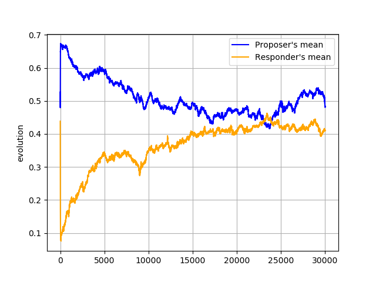

Ultimatum game
==============

Evolutionary approach to the [Ultimatum
Game](https://en.wikipedia.org/wiki/Ultimatum_game)

Setting
=======

Population of 30 Individuals, each with a couple of strategies for Proposer's
and Responder's roles evolve in a setting where richest 90% are kept in
population. Vacant places are filled with imprecise clones of the leaders.

