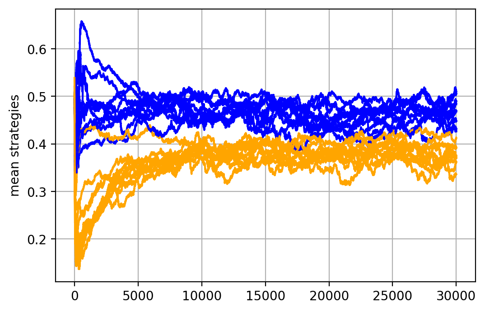

Ultimatum game experiment with Pylightnix
=========================================

[Full source](./Pylightnix.py)

This tutorial demonstrates how to use
[Pylightnix](https://github.com/stagedml/pylightnix) framework to run simple
experiment, in which we search evolutionary-stable strategy for the [Ultimatum
game](https://en.wikipedia.org/wiki/Ultimatum_game) by simulating the evolution
of playing agents.

In this simulation, agents will repeatedly play the Ultimatum game in two roles
('Proposer' and 'Responder'). They have different strategies for each role and
common fitness function. Both agent's strategies are the subjects for evolution.

**In this tutorial, our goal is to run 10 iterations of this experiment and
display mean strategy evolution for both roles on the same figure (20 lines
total).**

Planning the experiment
-----------------------

The function we are mostly interested in, is defined in `src/ultimatum/base.py`
module and has the following signature:

`def run1(cwd:str, nepoch=30000, n=300, nrounds=10*30, cutoff=0.1)->None`

As may be seen in it's body, it runs a single pass of evolution. By default, it
runs `30K` epochs on a population of `300` individuals. `nrounds` and `cutoff`
define minor details of the algorithm.

Before return, `run1` stores results in a directory, specified by it's `cwd`
argument. In particular, `history.json` file would contain data on mean
strategies for every epoch. Namely, it will have two floats, representing mean
shares that agents 'want' to own when participating the game as proposer and as
responder.

Preparation
-----------

Lets import some system functions the we will need in advance.


```python
from json import loads as json_loads, dumps as json_dumps
from os import getcwd, chdir
from os.path import join
from typing import List, Optional
```


Next, lets import Pylightnix API types and function we will need and become sure
that Pylightnix storage is initialized. `store_initialize` would initialize it
for us if it doesn't exist.


```python
from pylightnix import (
  Config, Manager, Build, DRef, RRef, ConfigAttrs, Closure, Path, mkdrv,
  instantiate, build_cattrs, build_wrapper, build_outpaths, store_initialize,
  match_latest, build_paths, build_outpath, realize, rref2path, mkconfig )

store_initialize('/tmp/ultimatum', '/tmp')
```

```
Initializing existing /tmp/ultimatum
```


Implementation
--------------

Lets re-state the task in Pylightinx' terms. We may say that we want to perform
a long calculation so splitting it into a sequence of steps is probably a good
idea. At each step we could cache results on disk and probably save some time if
something go wrong by not re-running the whole experiment from the beginning.

In Pylightnix we use term *Stage* to name individual step of calculation, it's
configuration and the calculating procedure. Results of calculation are called
*Realization*. We may think that stage is a synonym of OOP class and stage
realizations are similar to class objects. The difference is that stage stores
part of it's data in the filesystem storage.

Plotting the Ultimatum evolution is a rather simple task which requires two
stages:

1. *Evolution* stage which doesn't depend on any other stage. It's realizations
   should contain `history.json` files produced by `run1` runs.
2. *Summary* stage, a single realization of which depends on the last 10
   realizations of the Evolution stage. In this tutorial, Summary's realization
   will only contain a PNG picture that could be directly copy-pasted into
   experiment reports.

#### Defining Evolution stage

Here is how we define the Evolution object. Pylightnix offers two-phased build
process, in which it reads the plan of computation, and after that actually
executes it to produce the desired build artifacts. This design allows us
to check configurations quickly and hopefully catch early errors.

From the programmer's point of view, we are to provide Pylightnix with two
entities:

 * JSON-serializable _Config_  object which is a Python dictionary with
   user-defined values. (see `evolution_config` below).
 * _Realizer_ function which accepts `Build` helper object and by that relies
   on the following promises given by Pylightnix:
    - We already know config we are going to realize (see `build_cattrs`).
    - We have already realized all the dependencies (see `build_paths` of the
      Summary stage).
    - We are free to create one or more output directories for putting
      artifacts (see `build_outpaths`). Each output directory will be converted
      to stage realization by Pylightnix.


```python
from ultimatum.base import run1
from multiprocessing.pool import Pool

def evolution_config()->Config:
  name = 'ultimatum'
  nepoch = 30000
  n = 300
  nrounds = 10*30
  cutoff = 0.1
  version = 6
  nrunners = 10
  return mkconfig(locals())

def _run_process(a:ConfigAttrs, o:Path):
  run1(cwd=o, nepoch=a.nepoch, n=a.n, nrounds=a.nrounds, cutoff=a.cutoff)

def evolution_realize(b:Build)->None:
  c = build_cattrs(b)
  p = Pool()
  p.starmap(_run_process,[(c,o) for o in build_outpaths(b,nouts=c.nrunners)],1)
```


Now we complete the pylightnix stage definition by calling `mkdrv` where we pass
both entities as `config` and `realizer` arguments. The third argument is a
`matcher` which instructs Pylightnix how to choose realizations to pass to
downstream stages. Earlier we decided that we want 10 newest realizations of our
evolution experiment so we encode this fact now by calling the `match_latest`
matcher with appropriate parameter:


```python
def evolution_stage(m:Manager)->DRef:
  return mkdrv(m, config=evolution_config(),
                  matcher=match_latest(n=10),
                  realizer=build_wrapper(evolution_realize))
```


Now, when we have defined our first stage, we could have run it's realization
immediately, but it is not necessary because Pylightnix will execute it later
in the process of dependency resolution.

#### Defining Summary stage

The second stage that we need is a Summary. An important thing that we should
encode here is the dependency on Evolution realizations. The whole code of the
stage is shown below:


```python
import matplotlib.pyplot as plt

def summary_config(evolution:DRef)->Config:
  name = 'summary'
  history_refpath = [evolution, 'history.json']
  return mkconfig(locals())

def summary_realize(b:Build)->None:
  cwd = getcwd()
  try:
    chdir(build_outpath(b))
    c = build_cattrs(b)

    fig = plt.figure()
    ax = fig.add_subplot(1, 1, 1)
    ax.set_ylabel('mean strategies')
    ax.grid()

    for nhist,histpath in enumerate(build_paths(b, c.history_refpath)):
      epoches:List[float]=[]; pmeans:List[float]=[]; rmeans:List[float]=[]
      with open(histpath,'r') as f:
        epoches,pmeans,rmeans=json_loads(f.read())
      if nhist==0:
        pargs = {'label':'Proposer mean'}
        rargs = {'label':'Responder mean'}
      else:
        pargs = {}; rargs = {}
      ax.plot(epoches,pmeans,color='blue',**pargs)
      ax.plot(epoches,rmeans,color='orange',**rargs)
    plt.savefig('figure.png')

    ax.legend(loc='upper right')
  finally:
    chdir(cwd)

def summary_stage(m:Manager)->DRef:
  return mkdrv(m, config=summary_config(evolution_stage(m)),
                  matcher=match_latest(),
                  realizer=build_wrapper(summary_realize))
```


We encode the  Evolution dependency by including it's *Derivation reference* (of
type `DRef`) into the stage configuration. Pylightnix scans configurations so it
is able to extract the list of dependencies later. Derivation references are
strings, one example is 'dref:86ce1852b0f4f529c40a98f043ac1804-ultimatum'. It contains a
hash and a user-friendly name. The hash captures only the configuration of
stage, but as we will see, it includes the stage dependencies.

DRefs are produced by stage functions directly, so we have to call
`evolution_stage` in order add it as a dependency. In Pylightnix, stages accept
one mandatory argument of type *Manager*, which represents dependency resolution
spaces. We normally want all our stages to be in the same dependency resolution
space, so we pass the same Manager from one stage to another.

Note also the `[evolution, 'history.json']` expression which is called a
`RefPath`. It is a Python list of strings, where the first element is a
derivation reference and the rest are file/folder names. Pylightnix has a
helper function `build_paths` to resolve refpaths into one or many real
fylesystem paths.

In the above code we do use `build_paths` to actually access the dependencies.
Pylightnix promises that for every DRef listed in stage's configuration, the
call to `build_paths` returns system paths corresponding to it's realizations.
In our case, we get 10 folder paths, each folder containing a unique
`history.json` file.

As we can see in code, Summary stage does it's matplotlib magic and saves
`figure.png` to the folder that happens to be the output folder
(`build_outpath`) of the current stage.

#### Running the experiment

All stages are now defined and Pylightinx is ready to process our plan, which
now looks like:

```
1. Get 10 realizations of the Evolution stage
2. Get 1 realization of the Summary stage
```

To compile it, we call `instantiate` function, where we specify the stage we
want to reach.


```python
clo:Closure = instantiate(summary_stage)
```


Internally, Pylightnix creates the `Manager`, runs the configuration phases of
all the stages it meets, and returns a *Closure* of the requested stage.
Closures have no particular value for the user by itself.  The only meaningful
thing we could do is to realize them:


```python
rref:RRef = realize(clo)
```


Realize is the place where we do all the job. In this function Pylightnix
determines whether we have required realizations in the storage or not. If not,
it runs realizers in the right sequence. In our case, it will run evolution
stage's realizer to obtain the desired number of realizations, and the
Summary to plot them on a single figure.

The result of the whole process is a *realization reference* (of type `RRef`). Note,
that `realize` is a simplified function for the single-realization case. For
generic case we have `realizeMany` function which returns a list of many
realizations. Let's see what does realization reference looks like:


```python
print(rref)
```

```
rref:1187a83d1366ebdd411ec945d3c7cf0b-f90a7e18d2f962e76940ca70d7206907-summary
```


We see a string containing two hashes and a user-friendly name. The rightmost
hash captures the same thing that DRef does: stage configuration plus links to
dependencies. The leftmost hash captures build artifacts of a particular
realization.

RRefs have a good property that we could always convert them to system paths:


```python
print(rref2path(rref))
```

```
/tmp/ultimatum/f90a7e18d2f962e76940ca70d7206907-summary/1187a83d1366ebdd411ec945d3c7cf0b
```


To inspect the content of our realization, we could just list it's folder in the
filesystem. Alternatively we could use one of small shell-like helpers, defined
in Pylightnix:


```python
from pylightnix import lsref

print(lsref(rref))
```

```
['context.json', '__buildtime__.txt', 'figure.png']
```


Typical realization contains the following files:

- Build timestamp (not included into realization hash)
- Realization context, which tells us how the dependencies was resolved.
- User-defined build artifacts, in this case it is a single image named
  `figure.png`.

Now we may instruct rendering tools to include `figure.png` into experiment
reports. I use PWeave to prepare this tutorial, so I am asking it to
insert this image here:


\


Conclusion
----------

Thanks to Pylightnix, we did:

- Split the experiment in linked parts and run early-check of it's
  configurations.
- Cache intermediate and final results in the filesystem.
- Add only a small overhead in terms of both code size and technologies
  employed.

The full Python source of this tutorial is [here](./Pylightnix.py).

Happy hacking!


