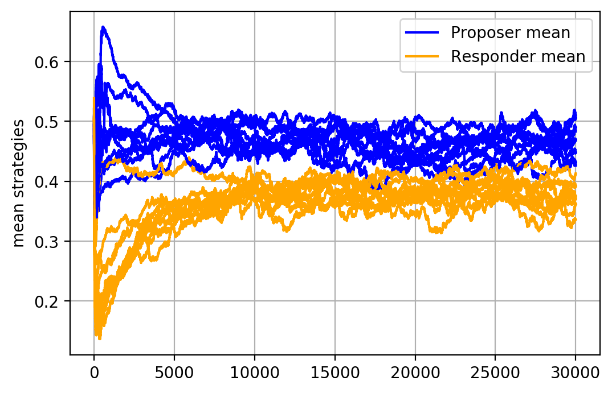

Ultimatum gmae experiment with Pylightnix
=========================================

[Full source here](./Pylightnix.py)

TODO: Describe the [Ultimatum game](https://en.wikipedia.org/wiki/Ultimatum_game).

Planning the experiment
-----------------------

Now to the experiment: the function we are mostly interested in, is defined in
`ultimatum.base` file and has the following type signature:

`def run1(cwd:str, nepoch=30000, n=300, nrounds=10*30, cutoff=0.1)->None`

This function runs a single instance of evolutionary model of the Ultimatum
game. By default, it runs `30K` epoches of evolution on a population of `300`
individuals. `nrounds` and `cutoff` are hyperparamethers which defines minor
details of our evolution algorithm.

As may be seen in it's code, `run1` stores `history.json` and `evolution.png`
files in a directory, specified in `cwd` argument. For every epoch of the
evolution, History file would contain information on mean strategies of 2 game
roles (proposer and responder). This information consists of two floats,
representing shares that agents 'want' to own when participating the game.

Our goal is to run 10 iterations of this algorithm and display the evolution of
mean strategies for all runs on the same figure.

Preparation
-----------

Lets import various system functions in advance.


```python
from json import loads as json_loads, dumps as json_dumps
from os import getcwd, chdir
from os.path import join
from typing import List, Optional
```


Next, lets become sure that Pylightnix storage is initialized in a separate
place. `store_initialize` would initialize it for us if it is not present.


```python
from pylightnix import (
  Config, Manager, Build, DRef, RRef, ConfigAttrs, Closure, mkdrv, instantiate,
  realizeMany, build_cattrs, build_wrapper, match_all, build_outpaths, Path,
  config_dict, build_config, store_initialize, match_latest, build_paths,
  build_outpath, realize, rref2path, mkconfig )

store_initialize('/tmp/ultimatum', '/tmp')
```

```
Initializing existing /tmp/ultimatum
```


Defining stages
---------------

Lets describe the task in Pylightinx terms. From it's point of view, we
need:

1. Some number of realizations of the same *Evolution* experiment. In particular,
   we want to get an access to evolution history files containing the data we are
   interested in.
2. A single realization of a *Summarizing* object which depends on, say, last 10
   realizations of the evolution history. Lets say that Summarizer object should
   only contain a target figure that we could copypaste into experiment report.

#### Evolution stage

Here is how we define the Evolution object. Pylightnix offers two-phased build
process, in wich it first reads the plan of computation, and only after that
actually executes it to obtain the desired build artifacts.  Tho-phased design
allows us to check configurations and hopefully catch some early errors.

From programmer's point of view, we are to provide two pieces of data:

 * _Config_  object which is a JSON-serailizable Python dict with user-defined
   values. In our case it is the result of `evolution_config()` function.
 * _Realizer_ function which accepts `Build` helper object and by that relies
   on the following promises given by Pylightnix:
    - We already know config we are going to realize (see `build_cattrs`).
    - We have already realized all the dependencies (see `build_paths` of the
      Summarizer stage).
    - We already know output directories which we could ask and use for putting
      artifacts (see `build_outpaths`). Note, in Pylightnix, realizers could produce several
      realizations at once.


```python
from ultimatum.base import run1
from multiprocessing.pool import Pool

def evolution_config()->Config:
  name='ultimatum'
  nepoch=30000
  n=300
  nrounds=10*30
  cutoff=0.1
  version=6
  nrunners=10
  return mkconfig(locals())

def _run_process(a:ConfigAttrs, o:Path):
  run1(cwd=o, nepoch=a.nepoch, n=a.n, nrounds=a.nrounds, cutoff=a.cutoff)

def evolution_realize(b:Build)->None:
  c=build_cattrs(b)
  p=Pool()
  p.starmap(_run_process,[(c,o) for o in build_outpaths(b,nouts=c.nrunners)],1)
```


Now we complete the pylightnix stage definition by calling `mkdrv` where we pass
both phases in it's `config` and `realizer` arguments. The third argument is a
`matcher` which instructs the Pylightnix which realizations to pass to
downstream stages. We already decided that we want 10 newest realizations of our
evolution experiment so we encode this fact by calling the `match_latest`
matcher with appropriate parameter:


```python
def evolution_stage(m:Manager)->DRef:
  return mkdrv(m, config=evolution_config(),
                  matcher=match_latest(top=10),
                  realizer=build_wrapper(evolution_realize))
```


Now, when we defined our first stage, we could have run it's realization
immediately, but it is not necessary because Pylightnix will execute it later
when it start it's work with dependencies.

#### Summarizer stage

The second object (the stage) that we need is Summarizer. An important thing
that we need to encode in it is the dependency on realizations of Evolution
object that we defined above.

This could be done by including Evolution's *Derivation reference* into
Summarizer's configuration. Pylightnix will scan the config and include it into
a list of dependencies.

In order to get the desired derivation reference, we have to call
`evolution_stage` with the right `Manager` argument. `Manager`s represent
dependency resolution spaces. We want our both stages to be in the same
dependency resolution space, so we make sure pass that both of them use the same
Manager.

Note also the `[evolution, 'history.json']` value which is known as a `RefPath`
object. It is a Python list consisting of a derivation reference head (a root)
and folders/file names tail. Pylightnix provides `build_paths` function to
dereference such refpaths into one or many real fylesystem paths.


```python
import matplotlib.pyplot as plt

def summarize_config(evolution:DRef)->Config:
  name = 'analyzer'
  version = 3
  history_refpath = [evolution, 'history.json']
  return mkconfig(locals())

def summarize_build(b:Build)->None:
  cwd=getcwd()
  try:
    chdir(build_outpath(b))
    c=build_cattrs(b)

    fig=plt.figure()
    ax=fig.add_subplot(1, 1, 1)
    ax.set_ylabel('mean strategies')
    ax.grid()

    for nhist,histpath in enumerate(build_paths(b, c.history_refpath)):
      epoches:List[float]=[]; pmeans:List[float]=[]; rmeans:List[float]=[]
      with open(histpath,'r') as f:
        epoches,pmeans,rmeans=json_loads(f.read())
      ax.plot(epoches,pmeans,label=f'pmeans{nhist}',color='blue')
      ax.plot(epoches,rmeans,label=f'rmeans{nhist}',color='orange')
    plt.savefig('figure.png')
  finally:
    chdir(cwd)

def summarize_stage(m:Manager)->DRef:
  return mkdrv(m, config=summarize_config(evolution_stage(m)),
                  matcher=match_latest(),
                  realizer=build_wrapper(summarize_build))
```


The interesting place here is the call to `build_paths(b, c.history)`. It
explains how do we access dependencies. Pylightnix promises that such call will
always complete and return a list of paths, as instructed by the `Matcher` of
the RefPath's root stage. In our case, `c.history_refpath` points to Evolution
stage's newest histories. We get 10 paths, each containing it's unique
`history.json`.

As we can see in code, Summarizer does it's matplotlib magic and saves
`figure.png` to the folder that happens to be the output folder of the current
stage.

#### Realization

At this point, Pylightinx is ready to know our full plan, which looks like:

```
1. Get 10 copies of Evolution
2. Get 1 copy of Summarizer
```

In order to let it actually understand it, we call `instantiate` function,
where we specify the stage we want to reach.


```python
clo:Closure=instantiate(summarize_stage)
```


Internally, Pylightnix creates the *Manager* (a resolution space), runs the
configuration phases of all the stages it meets, and returns a *Closure* of the
requested stage. This closure have no particular value for the programmer except
the possibility of realizing it.


```python
rref:RRef=realize(clo)
```


Realize is the place where the actual work starts. In realize, Pylightnix
determines whether we have required realizations in the storage or not. If not,
it runs realizers in the right sequence. In our case, it will run evolution
stage to obtain the desired number of realizations, and then run the summarizer.

The result of this process is a *realization reference* which looks like this:


```python
print(rref)
```

```
rref:1187a83d1366ebdd411ec945d3c7cf0b-15916de4c76ec240e88e03f819db20be-analyzer
```


It has a good property that we could always convert it to a system path:


```python
print(rref2path(rref))
```

```
/tmp/ultimatum/15916de4c76ec240e88e03f819db20be-analyzer/1187a83d1366ebdd411ec945d3c7cf0b
```


To inspect content of the realization, we just list the folder it points to.
Also we could use one of small shell-like helpers, defined in Pylightnix:


```python
from pylightnix import lsref

print(lsref(rref))
```

```
['context.json', '__buildtime__.txt', 'figure.png']
```


Later we could instruct rendering tools to include `figure.png` into
our experiment report. I did exactly that while writing this tutorial:


\


Happy hacking!


